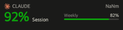

# CodexBar Usage (plugin-FlexDesigner-codexbar)

**English** | [简体中文](README.zh-CN.md)

Show the remaining AI-coding quota reported by [CodexBar](https://github.com/steipete/CodexBar) right on your [Flexbar](https://github.com/ENIAC-Tech/FlexDesigner) keys. All data comes from the local CodexBar CLI — the plugin does no auth and talks to no provider itself (see `docs/adr/0001`).



## The Key

The plugin provides a single key type, the **Usage Key**: pick a Provider in the key settings (codex / claude / cursor / gemini / copilot / zai / kimi first, every other CodexBar id available), and the key continuously shows:

- **Brand logo** — large, on the left edge, vertically centred (codex / claude / gemini / copilot / cursor / z.ai / kimi / qwen / deepseek have logos; others fall back to a text label)
- **Two bars** — the 5-hour window on top, the weekly window beneath, each with a short label (`5h` / `7d`), a progress bar and its remaining percentage, tier-coloured (>50 green, >20 yellow, >5 orange, else red — digits always shown). claude / codex / GLM / kimi share this layout; other providers order by CodexBar's primary window, and single-window providers draw one bar (ADR 0002)
- **Top-right** — reset countdown of the first window (`2h13m` / `3d4h` / `45m`); shows the window name when the window has not started
- On refresh failure the last numbers stay with a `·stale` marker; if data never arrived you get an error card naming the reason
- Click the key to refresh immediately

Keys showing the same provider share one query; default polling is every 120 seconds (configurable); polling stops when the last key for a provider leaves the screen.

## Global settings

- Refresh interval (seconds, default 120) — applies to every provider immediately
- codexbar path (optional) — leave empty to auto-detect (`/opt/homebrew/bin` → `/usr/local/bin` → `PATH`)

## Install

Download `com.xli.codexbar.flexplugin` from the [releases](https://github.com/yarneer/plugin-FlexDesigner-codexbar/releases) page and install it via FlexDesigner, or from source:

```bash
npm install
npm run build
npm run plugin:pack      # produces com.xli.codexbar.flexplugin
npm run plugin:install   # installs into local FlexDesigner
```

Requirements: macOS, Node ≥ 20 (on Node 24 `npm install` auto-patches flexcli's removed `assert` JSON-import syntax), CodexBar CLI installed.

## Development

```bash
npm test               # behaviour tests: no Flexbar, no CodexBar needed
npm run dev            # link into FlexDesigner with watch + debug
npm run render:samples # re-render docs/images/samples from real fixtures
```

## Layout

```
src/plugin.js      SDK adapter: events → controller, KeyView → plugin.draw
src/controller.js  key controller (the only test seam): scheduling, shared snapshots, backoff, KeyView
src/codexbar.js    CodexBar CLI client: binary lookup, exec, typed failures
src/snapshot.js    normalisation (pure): drops identity/pace/details
src/format.js      pure formatting: countdown, window names, colour tiers, redaction
src/logos.js       brand logo glyphs (simple-icons CC0 / lobehub MIT)
src/render.js      KeyView → PNG
test/              node --test; fixtures are real CodexBar 0.67.0 output (sanitised)
```

Privacy rule: account emails and account ids never reach a Snapshot, KeyView or log (a dummy email is deliberately planted in a fixture to prove it).
